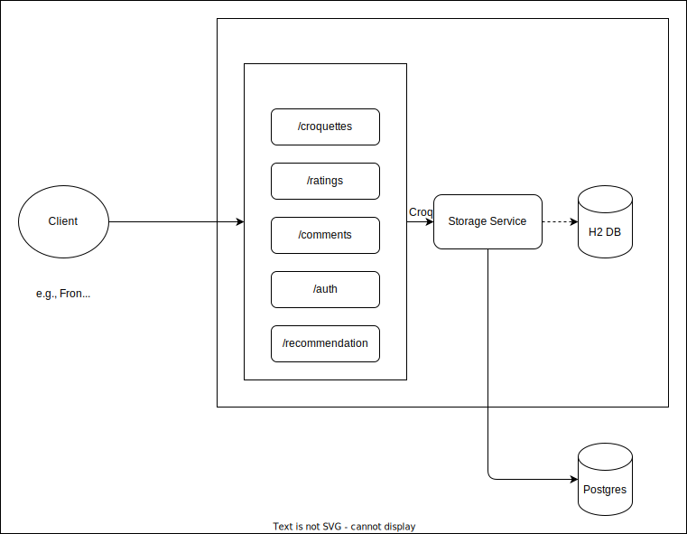
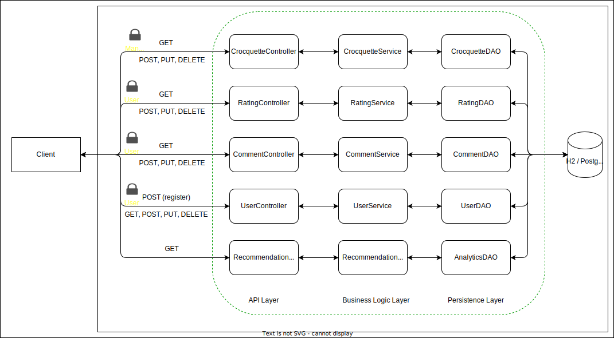
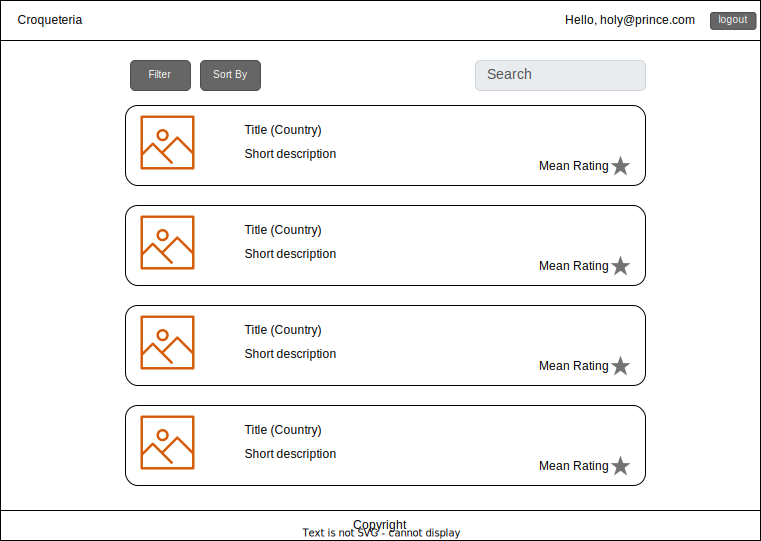
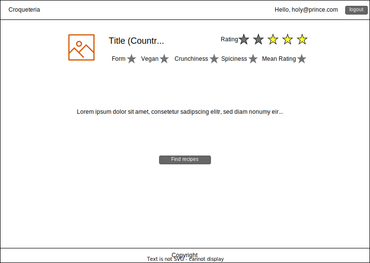

# Croqueteria - Concept

Croqueteria is service that allows to describe, rate and discuss the most delicious croquettes around the globe.

## Requirements

Requirements were assembled by the challenge itself and requirements that emerged in a fictive customer interview.

### Functional Requirements

- (P1) Entities: Croquettes, Ratings, Conversation, User.
- (P1) CRUD operations for each entity exposed via RESTful API.
- (P1) Users can sign on.
- (P1) Persistent storage of all entities.
- (P1) API documentation using Swagger/OpenAPI.
- (P2) Search croquettes: Allow to search for croquettes by text in description.
- (P2) Filter croquettes: Allow to filter by the criteria provided in the croquette's entity.
- (P2) Recommendation system: Recommend croquettes based on criteria provided in the croquette's entity.
- (P3) Frontend: A nice UI that allows to interact with the API and provides a beautiful croquette discussion experience.
- (P3) Request caching system.

### Security Requirements

- (P1) Croquettes: Should be visible by everybody, but only modifiable by mangers. (User type MANAGER)
- (P1) Ratings: Should be visible by everybody. Only registered users can contribute. (User types ANON and USER)
- (P1) Conversations: Should be visible by everybody. Only registered users can contribute. (User types ANON and USER)
- (P2) Users: Managers can promote/lessen users to manager/user or delete users. (User type MANAGER)

### Non-Functional Requirements

- Expected mean of 200 requests per minute needs to be achievable.
- Project might grow in the future; the architecture needs to be prepared to scale (modular, readable, maintainable).
- Sufficient unit and integration testing.

### Entities

Below is a full list of all entities that need to be represented in the API.
All entities additionally have a `created_at` and `updated_at` field, managed by the database.

 
Croquette

> | Field       | Type     | Description                                        |
> | ----------- | -------- | -------------------------------------------------- |
> | id          | Long Int | Primary identifier.                                |
> | country     | String   | Home of this type of croquette .                   |
> | name        | String   | The name of the croquette, if available.           |
> | description | String   | Describes the croquettes and their ingredients.    |
> | crunchiness | Int      | How crunchy is the croquette on a 1-5 scale?       |
> | spiciness   | Int      | How spicy is the croquette on a 1-5 scale?         |
> | vegan       | Boolean  | Is it vegan?                                       |
> | form        | String   | cylindric, disk, ball, oval, or other.             |
> | imageUrl?   | String   | Optional url pointing to an image of the croquette |

 
Rating

> | Field        | Type     | Description                                           |
> | ------------ | -------- | ----------------------------------------------------- |
> | id           | Long Int | Primary identifier.                                   |
> | croquette_id | Long Int | Foreign key, linking to the croquette.                |
> | user_id      | Long Int | Foreign key, linking the user.                        |
> | rating       | Int      | 1-5 rating of a certain user for a certain croquette. |

 
Conversation

> | Field        | Type     | Description                                      |
> | ------------ | -------- | ------------------------------------------------ |
> | id           | Long Int | Primary identifier.                              |
> | croquette_id | Long Int | Foreign key, linking to the croquette.           |
> | user_id      | Long Int | Foreign key, linking the user.                   |
> | comment      | String   | Comment of a certain user to a certain croquette |

 
User

> | Field    | Type     | Description                         |
> | -------- | -------- | ----------------------------------- |
> | id       | Long Int | Primary identifier.                 |
> | email    | String   | User's email, serving as user name. |
> | password | String   | Hashed user password.               |
> | role     | String   | User or Manager                     |

## Technology Stack

The project makes use of `Spring Boot`.
`Kotlin` was chosen over `Java`, mainly due to its concise syntax and null safety.
For the ease of development, a `H2` in-memory database is used for dev and test environment and `PostgreSQL` for production.
In this stage of the project only database agnosic JPA repositories should be used.
Goal is to make it as easy as possible to run the integration test against both types of database.
It was decided to use `MVC` over `WebFlux` since the API is not expected to handle a large number of concurrent connections nor real-time data streams.
If a frontend will be provided, it will be built on `React` (JS) on `Vite` with `Styled Components` which is a perfect match for the provided RESTful API.

### Alternatives

There are many alternatives to the technology stack described above, all with their individual benefits and drawbacks.
These are two possibilities following a different approach compared to the task provided:

**Full Stack Framework**: If UI was higher in priority, a full stack framework like `Next.js` and its unified codebase for frontend and backend would be an alternative.
It provides simple prototyping and simplifies backend logic for small to mid-scale projects.
Main drawback and reason why Next.js is not a good alternative for this project is its lack of scalability in the API layer and its lack of robustness compared to what Spring Boot can provide for more complex backends.
Also, the tight coupling between frontend and backend may limit flexibility in the feature, especially on an enterprise scale level.

**Serverless Architecture**: If massive scaling with no server management was the focus for this project, a serverless architecture based on -for example- `AWS Lambda` could help in providing a good alternative which is both flexible and cost-efficient for microservices or event-driven approaches.
Its main drawbacks is that it is harder to debug and test locally during development.

## Architecture Overview

The architecture follows a modular monolithic approach.
Goal is to keep development fast and simple while logically separating the components to _allow_ later migration to microservices or an event-driven approach, if required.
While microservices would make it easier to scale each component independently, simple service instance calls become API requests which adds significant overhead to each request.
On top comes an increased infrastructure complexity due to the need of gateways and load balancers.
At the current scale of the project, relatively low computational effort per module is expected, which makes the modular monolith arguably the best approach.

Access to the functionality is provided via RESTful API.
The main reason for this is that the API is mostly resource oriented, i.e., the entities can be mapped more or less directly to REST resources and HTTP request types.
In addition to this, Spring Boot has an excellent support for RESTful APIs in terms of security (Spring Security and JWT) as well as documentation (Swagger/OpenAPI).
After registering and logging in, a role-based authentication on JWT will be used to distinguish between unregistered users (`ANON`), registered users (`USER`), and managers (`MANAGER`)with different permissions.

### API Endpoints

These are all endpoints that need to exposed by the API.

/croquettes

> | Request | Endpoint | Role    | Description                                                                   |
> | ------- | -------- | ------- | ----------------------------------------------------------------------------- |
> | GET     | `/{id?}` | Any     | Returns all (sorted/filtered) croquettes or a single one if `id` is provided. |
> | POST    | `/`      | Manager | Creates a new croquette.                                                      |
> | PUT     | `/{id}`  | Manager | Update an existing croquette referenced by `id`.                              |
> | DELETE  | `/{id}`  | Manager | Deletes an existing croquette, referenced by `id`.                            |

- Fields to sort by ascending and descending: `rating`, `spiciness`, `crunchiness`, `name`.
- Fields to filter by: `mean_rating` (>=), `vegan`, `form`, `description` (contains keyword).

 /ratings

> | Request | Endpoint | Role | Description                                                         |
> | ------- | -------- | ---- | ------------------------------------------------------------------- |
> | GET     | `/{id?}` | Any  | Returns all (filtered) ratings or a single one if `id` is provided. |
> | POST    | `/`      | User | Adds a new croquette rating.                                        |
> | PUT     | `/{id}`  | User | Update an existing rating referenced by `id`.                       |
> | DELETE  | `/{id}`  | User | Deletes an existing rating, referenced by `id`.                     |

- Fields to filter: `croquette_id`

 /comments

> | Request | Endpoint | Role | Description                                                          |
> | ------- | -------- | ---- | -------------------------------------------------------------------- |
> | GET     | `/{id?}` | Any  | Returns all (filtered) comments or a single one if `id` is provided. |
> | POST    | `/`      | User | Adds a new croquette comment.                                        |
> | PUT     | `/{id}`  | User | Update an existing comment referenced by `id`.                       |
> | DELETE  | `/{id}`  | User | Deletes an existing comment, referenced by `id`.                     |

- Fields to filter: `croquette_id`

 /users

> | Request | Endpoint | Role         | Description                                                                                   |
> | ------- | -------- | ------------ | --------------------------------------------------------------------------------------------- |
> | GET     | `/{id?}` | User/Manager | Returns all (filtered) users or a single one if `id` is provided and permissions are granted. |
> | POST    | `/`      | Any          | Registers a new user.                                                                         |
> | PUT     | `/{id}`  | Manager      | Update an existing user referenced by `id`.                                                   |
> | DELETE  | `/{id}`  | Manager      | Deletes an existing user, referenced by `id`.                                                 |

- Fields to filter: `role`

 /recommendations

> | Request | Endpoint | Role | Description                                                                                        |
> | ------- | -------- | ---- | -------------------------------------------------------------------------------------------------- |
> | GET     | `/`      | Any  | Returns a list of croquettes that match best to the filter criteria provided.                      |
> | GET     | `/text`  | Any  | Returns a list of croquettes that match best to a provided description, recommended by a tiny LLM. |

- Filter criteria that can be provided:`spiciness`, `crunchiness`, `vegan`, `form`.

## Testing Strategy

The project follows a "hybrid" strategy of Test-Driven Development (TDD) and Test-Last Development (TLD):

- Integration tests validate the high-level behavior. These tests act as acceptance criteria.
- Controller Unit validate the verification of request parameters.
- Remaining unit tests are written as classes/functions emerge and where required.

## Documentation

The project provides two types of documentation:

- [Developer documentation](https://github.com/dextreem/krokettenbude) that describes to set up, run, and contribute to the stack.
- API documentation on [localhost](http://localhost:8080/swagger-ui/index.html) via Swagger/OpenAPI that describes the exposed endpoints.

## Frontend Sketch

There are three views: Login, Croquette Overview, and Croquette Details.
The login screen is a simple form that requires the user to type their credentials.

After logging in, the user is presented with an overview of all existing croquettes.
There is functionality, to search, filter and sort the results by croquette related criteria:

Upon clicking on one of the elements in the Croquette list, a detail view is opened providing all the details and allows the user to rate the croquette.

