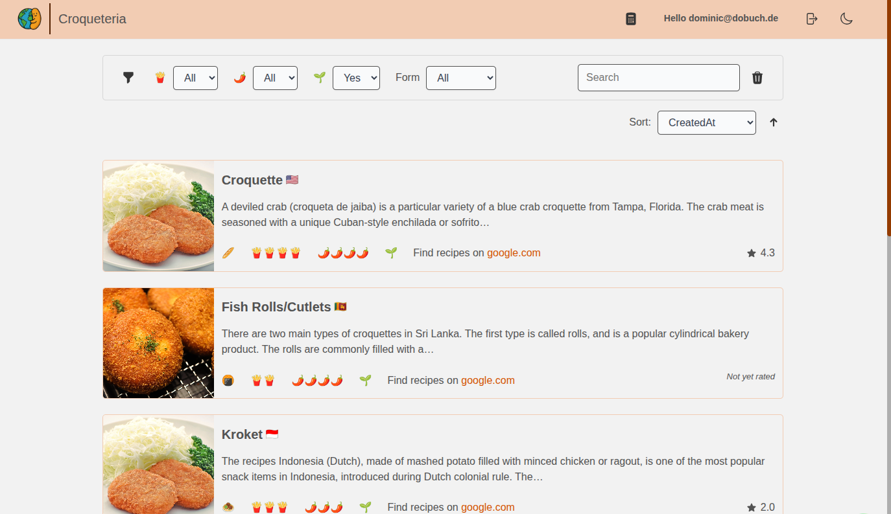

# Croqueteria UI



## Concept

UI concept is part of the full project concept [here](../docs/concept/concept.md).
Please note: It is a very vague concept which describes the rough design of the app.
This is because the UI basically maps most of the backend functionality (not all) to the respective pages.

## Build and run The Service

It's a regular npm project. After cloning run `npm install` and `npm run dev` to run the project.
For a production grade version, run `npm run build`

## Docker Image

Building a docker image is the easiest way to bundle the application.

### Manually

Run these commands to build and bundle the project:

```bash
cd frontend
npm run build # Only required to make sure the frontend is building successfully
podman build -t croqueteria-frontend .
podman run -p 80:80 croqueteria-frontend

```

### Using GitHub

[ci.ml](.github/workflows/ci.yml) provides a workflow that builds a docker image and uploads it as artifact to GitHub.

### Using Act

Install `act` following the [official guide](https://github.com/nektos/act), in my case:

```bash
yum -S act
```

Run build and test job:

```bash
act --env BUILD_ENVIRONMENT=LOCAL --bind $(pwd):/github/workspace -j build-frontend -P ubuntu-latest=catthehacker/ubuntu:act-latest
```

Load the docker image:

```bash
podman load -i artifacts/image.tar
```

## Get API types

This is required whenever something on the backend changes that has an effect on the API.
In other words: if swagger-docs changed, runt this:

```bash
curl http://localhost:8080/v3/api-docs -o api-docs.json

openapi-generator generate -i ./api-docs.json -g typescript-fetch -o ./src/api-client
# or
podman run --rm -v ${PWD}:/local docker.io/openapitools/openapi-generator-cli generate \
  -i /local/api-docs.json \
  -g typescript-fetch \
  -o /local/src/api-client
```

## Known Limitations

- No tests
- Linting is restricted due to auto-generated code
